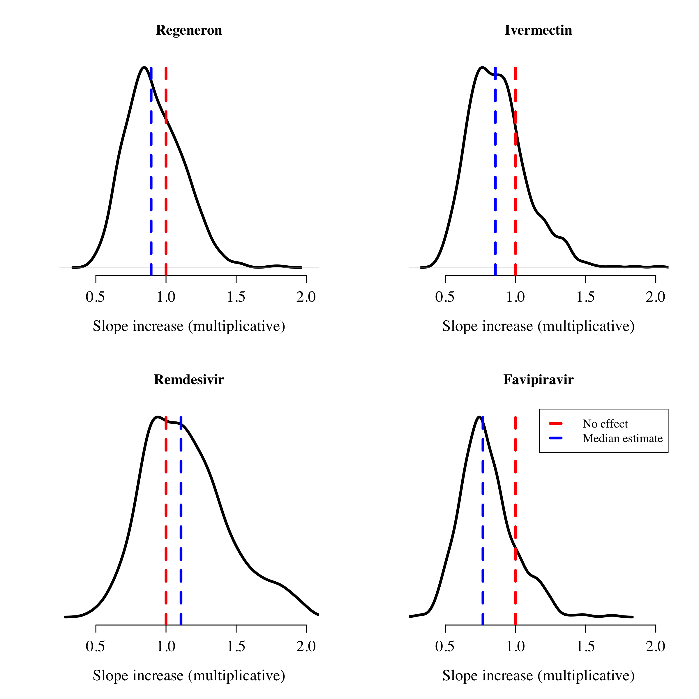

TODO list:

* Add QC analysis (comparison of standard curves)
* Up and down model to account for the fact that subjects are in an increasing phase
* Data need to be also on the log viral copies per ml
* How much variance explained by the RNaseP
* Check missing data (vaccine/serology/age)
* Subgroup analysis model for temporal shift
* Define Epochs for the trial to get drift effects
* Model comparison using loo package

## Preambule

This Statistical Analysis Plan (SAP) is written for the PLATCOV trial (registered at ClinicalTrials.gov: https://clinicaltrials.gov/ct2/show/NCT05041907).

Data preparation is done in a different R script called data_prep.R.
This Markdown script assumes that the data are saved in two .csv file in long format. 

The first file interim_control_dat.csv contains the PCR quality control data: CT values from the control samples from each plate (duplicate control samples of known viral densities over the range 100 to 10^7/mL viral copies per mL). This has the following headers:

- ID: unique control ID
- Plate: unique Plate ID for the PCR assay
- CT_NS: observed Ct value for the N/S gene
- log10_true_density: number of viral copies in control sample (log10 scale)

The second file interim_dat.csv contains the patient viral load data with the following column headers:

- ID: anonymised patient id code
- BARCODE: unique sample id code (in the following format: PLT-site-number-swab type-timepoint)
- Swab_ID: RTS or TSL (right versus left tonsil)
- Plate: unique Plate ID for the PCR assay (matching with plate identifiers in interim_control_dat.csv)
- Site: site at enrollment
- Trt: treatment allocation as written in CRF
- Time: time from randomisation
- Variant: variant of concern (using standard WHO terminology for the main lineages, reference will be the predominant variant in the dataset at the start of the study)
- Vaccinated: 0/1 (1: any number of doses and any manufacturer)
- Vaccine_type: manufacturer of vaccine dose 1 (AZ: astra zeneca; SPH: sinopharm; SV: sinovac; MD: moderna; PZ: pfizer)
- Antibody_test: 0/1 (positive/negative for SARS-CoV-2 antibody rapid test)
- Age: (years - has to be between 18-50)
- Sex: 0/1 (male: 1; female/other: 0)
- Symptom_onset: time since onset of symptoms (days)
- CT_NS: observed Ct value for the N/S gene
- CT_RNaseP: observed Ct value for the human RNase P gene
- log10_viral_load: log10 number of viral copies per mL (estimated from plat specific standard curve)


## Setup


```
##                _                           
## platform       x86_64-apple-darwin17.0     
## arch           x86_64                      
## os             darwin17.0                  
## system         x86_64, darwin17.0          
## status                                     
## major          4                           
## minor          0.2                         
## year           2020                        
## month          06                          
## day            22                          
## svn rev        78730                       
## language       R                           
## version.string R version 4.0.2 (2020-06-22)
## nickname       Taking Off Again
```

```
## R version 4.0.2 (2020-06-22)
## Platform: x86_64-apple-darwin17.0 (64-bit)
## Running under: macOS  10.16
## 
## Matrix products: default
## BLAS:   /Library/Frameworks/R.framework/Versions/4.0/Resources/lib/libRblas.dylib
## LAPACK: /Library/Frameworks/R.framework/Versions/4.0/Resources/lib/libRlapack.dylib
## 
## locale:
## [1] en_US.UTF-8/en_US.UTF-8/en_US.UTF-8/C/en_US.UTF-8/en_US.UTF-8
## 
## attached base packages:
## [1] stats     graphics  grDevices utils     datasets  methods   base     
## 
## other attached packages:
## [1] censReg_0.5-32       maxLik_1.5-2         miscTools_0.6-26    
## [4] RColorBrewer_1.1-2   rstan_2.21.2         ggplot2_3.3.5       
## [7] StanHeaders_2.21.0-7
## 
## loaded via a namespace (and not attached):
##  [1] bdsmatrix_1.3-4    Rcpp_1.0.7         lattice_0.20-45    prettyunits_1.1.1 
##  [5] ps_1.6.0           zoo_1.8-9          lmtest_0.9-38      assertthat_0.2.1  
##  [9] glmmML_1.1.1       digest_0.6.28      utf8_1.2.2         V8_3.4.2          
## [13] R6_2.5.1           stats4_4.0.2       evaluate_0.14      pillar_1.6.4      
## [17] Rdpack_2.1.2       rlang_0.4.12       curl_4.3.2         rstudioapi_0.13   
## [21] callr_3.7.0        jquerylib_0.1.4    rmarkdown_2.11     stringr_1.4.0     
## [25] loo_2.4.1          munsell_0.5.0      compiler_4.0.2     xfun_0.27         
## [29] pkgconfig_2.0.3    pkgbuild_1.2.0     htmltools_0.5.2    tidyselect_1.1.1  
## [33] tibble_3.1.5       gridExtra_2.3      codetools_0.2-18   matrixStats_0.61.0
## [37] fansi_0.5.0        crayon_1.4.2       dplyr_1.0.7        withr_2.4.2       
## [41] rbibutils_2.2.4    MASS_7.3-54        grid_4.0.2         nlme_3.1-153      
## [45] jsonlite_1.7.2     gtable_0.3.0       lifecycle_1.0.1    DBI_1.1.1         
## [49] magrittr_2.0.1     scales_1.1.1       RcppParallel_5.1.4 cli_3.1.0         
## [53] stringi_1.7.5      plm_2.4-3          bslib_0.3.1        ellipsis_0.3.2    
## [57] generics_0.1.1     vctrs_0.3.8        sandwich_3.0-1     Formula_1.2-4     
## [61] tools_4.0.2        glue_1.4.2         purrr_0.3.4        processx_3.5.2    
## [65] parallel_4.0.2     fastmap_1.1.0      yaml_2.2.1         inline_0.3.19     
## [69] colorspace_2.0-2   knitr_1.36         sass_0.4.0
```


## Load data and provide data summaries


```
## We have 720 PCR datapoints on 36 patients from 1 sites
```

```
##                Site
## Arm             th001
##   Favipiravir      12
##   Ivermectin        4
##   No study drug     5
##   Regeneron         6
##   Remdesivir        9
```

```
## Age distribution of patients:
```

```
##    Site Age.mean Age.min Age.max
## 1 th001       30      21      49
```

```
## Proportion male (%):
```

```
##    Site Sex
## 1 th001 100
```

```
## [1] "!! WARNING - sex data made up as not in current clinical database that was sent !!"
```

```
## Proportion vaccinated (%):
```

```
##    Site Vaccinated
## 1 th001         81
```

```
## Vaccine type by site:
```

```
##        
## Site    AZ None SPH SV
##   th001 14    7   9  6
```

```
## Number of days since symptom onset by site:
```

```
##        Sympom_Onset_days
## Site     1  2  3  4
##   th001 14 11 10  1
```

```
## Number of baseline viral load samples:
```

```
## 
## PLT-TH1-001 PLT-TH1-002 PLT-TH1-003 PLT-TH1-004 PLT-TH1-005 PLT-TH1-006 
##           4           4           4           4           4           4 
## PLT-TH1-007 PLT-TH1-008 PLT-TH1-009 PLT-TH1-010 PLT-TH1-011 PLT-TH1-012 
##           4           4           4           4           4           4 
## PLT-TH1-013 PLT-TH1-014 PLT-TH1-015 PLT-TH1-016 PLT-TH1-017 PLT-TH1-018 
##           4           4           4           4           4           4 
## PLT-TH1-019 PLT-TH1-020 PLT-TH1-021 PLT-TH1-022 PLT-TH1-023 PLT-TH1-024 
##           4           4           4           4           4           4 
## PLT-TH1-025 PLT-TH1-026 PLT-TH1-027 PLT-TH1-028 PLT-TH1-029 PLT-TH1-030 
##           4           4           4           4           4           4 
## PLT-TH1-031 PLT-TH1-032 PLT-TH1-033 PLT-TH1-034 PLT-TH1-042 PLT-TH1-045 
##           4           4           4           4           4           4
```

```
## [1] TRUE
```

```
## In the 36 patients, the geometric mean baseline (defined as samples taken within 6 hours of randomisation) viral load was 291643 copies per mL (95 percentile interval from 1300 to 65433435; range from 370 to 76230035)
```

<!-- -->

## Data visualisation

### Quality Control for PCR


```
## SD of the intercept is 0.52
```

```
## Maximum difference in CT values for a tenfold change in viral load is 0.2
```

<!-- --><!-- -->


### Overall data

<!-- -->


### RNaseP

<!-- -->

```
## the standard deviation of the RNaseP CT distribution is 1.26.
```

```
## 95% of the distribution is within 4.92 CT values difference
```


## Model fitting


Main models: Bayesian hierarchical models with and without covariate adjustment. All models adjust for human RNaseP quantification (scaled to have mean 0).

Covariates that we use in model 2:

* Vaccination (yes/no)
* Time since symptom onset (days)
* Variant (made up data)
* Serology rapid test (+/-)


### Specify priors


```
## $A0_prior_mean
## [1] 18
## 
## $A0_prior_sd
## [1] 5
## 
## $alpha_prior_mean
## [1] -2
## 
## $alpha_prior_sd
## [1] 2
## 
## $sigma_trt_effect
## [1] 0.5
```


### Prepare model

compile model in stan


make stan data set


```
## Total number of datapoints up until day 8 is 648
```

### Run models

run models


### Model fits: summaries


```
##                      mean     se_mean         sd
## A0            15.63438524 0.020613968 0.56920427
## alpha         -1.28797022 0.007900411 0.19835772
## trt_effect[1]  0.44645636 0.008509104 0.21519457
## trt_effect[2] -0.03264431 0.008000248 0.20435923
## trt_effect[3]  0.02468407 0.007787850 0.22156401
## trt_effect[4] -0.05125470 0.008566895 0.21000430
## sigmaCT        2.76966659 0.005293131 0.15450745
## t_dof          4.29459005 0.033197592 0.91955025
## gamma_rnasep   0.61680376 0.004663758 0.13565463
## sigma_plate    0.45833052 0.004478127 0.12660382
## sigmasq_u[1]   3.09531859 0.015487882 0.41972091
## sigmasq_u[2]   0.41297781 0.002945989 0.08453951
```

```
##                      mean     se_mean         sd
## A0            15.47638388 0.020348891 0.55382919
## alpha         -1.21797780 0.007614978 0.20757918
## trt_effect[1]  0.47262408 0.008280706 0.22752230
## trt_effect[2] -0.04913559 0.007834435 0.22128899
## trt_effect[3]  0.01340048 0.008181407 0.23396169
## trt_effect[4] -0.09058570 0.008127051 0.22944685
## sigmaCT        2.83371764 0.005582718 0.15851785
## t_dof          4.32786824 0.031849655 0.88900940
## gamma_rnasep  -0.06878371 0.038424010 1.05147098
## sigma_plate    0.46641747 0.005135208 0.13505440
## sigmasq_u[1]   3.04162723 0.014444483 0.40118814
## sigmasq_u[2]   0.45323094 0.003312580 0.09061532
```

```
##                      mean     se_mean        sd
## A0            18.28147484 0.039001266 1.1231012
## alpha         -1.19366169 0.011376378 0.3237261
## trt_effect[1]  0.44294497 0.008349659 0.2296861
## trt_effect[2] -0.02270909 0.008472036 0.2231237
## trt_effect[3]  0.02031691 0.009370106 0.2296575
## trt_effect[4] -0.09749184 0.008464021 0.2264895
## sigmaCT        2.77444751 0.005741839 0.1540943
## t_dof          4.32559872 0.033395478 0.9021738
## gamma_rnasep   0.60755721 0.005109984 0.1410988
## sigma_plate    0.46600648 0.004701295 0.1350108
## sigmasq_u[1]   2.78159356 0.013280412 0.3913554
## sigmasq_u[2]   0.43552851 0.003326625 0.0840446
```

<!-- --><!-- --><!-- -->


## Results

### Estimated treatment effects: no covariate adjustment

Posterior distributions over the treatment effects for the interventions. Red: no effect; blue: median inferred effect.


```
##   Regeneron  Ivermectin  Remdesivir Favipiravir 
##   1.5627645   0.9678828   1.0249912   0.9500367
```

```
## Probability that Regeneron increases the viral clearance slope by more than 5%: 0.97
```

```
## Probability that Ivermectin increases the viral clearance slope by more than 5%: 0.33
```

```
## Probability that Remdesivir increases the viral clearance slope by more than 5%: 0.45
```

```
## Probability that Favipiravir increases the viral clearance slope by more than 5%: 0.32
```

<!-- -->


### Estimated treatment effects: with covariate adjustment


Posterior distributions over the treatment effects for the interventions, after adjustment for the key covariates (. Red: no effect; blue: median inferred effect.


```
##   Regeneron  Ivermectin  Remdesivir Favipiravir 
##   1.5572866   0.9775468   1.0205247   0.9071097
```

```
## Probability that Regeneron increases the viral clearance slope by more than 5%: 0.96
```

```
## Probability that Ivermectin increases the viral clearance slope by more than 5%: 0.38
```

```
## Probability that Remdesivir increases the viral clearance slope by more than 5%: 0.47
```

```
## Probability that Favipiravir increases the viral clearance slope by more than 5%: 0.26
```

<!-- -->

### Estimated covariate effects

#### RNaseP

Gamma is the parameter

<!-- -->


#### Other covariates

<!-- -->

### Individual fits

Individual plots. Thick line no covariate adjustment; dashed line covariate adjustment.


<!-- --><!-- --><!-- --><!-- -->


## Sensitivity analysis

### Left vs right tonsil

<!-- --><!-- --><!-- --><!-- -->

### Basic slope - individually fit

Use left censored linear regression

<!-- --><!-- -->
